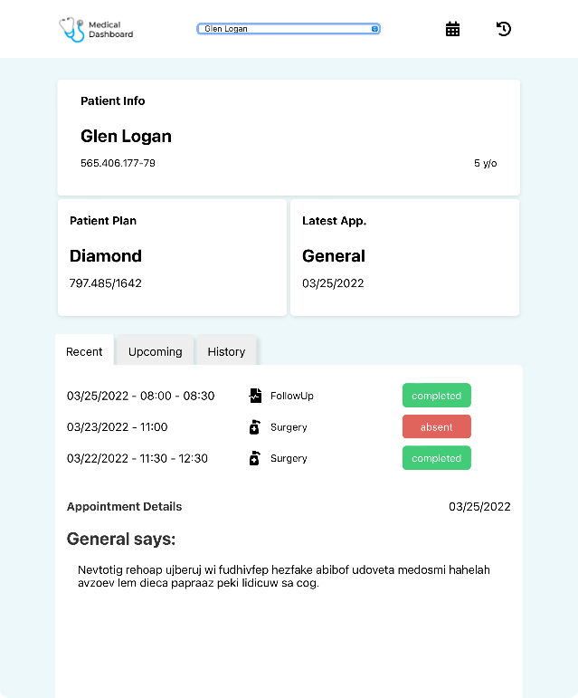
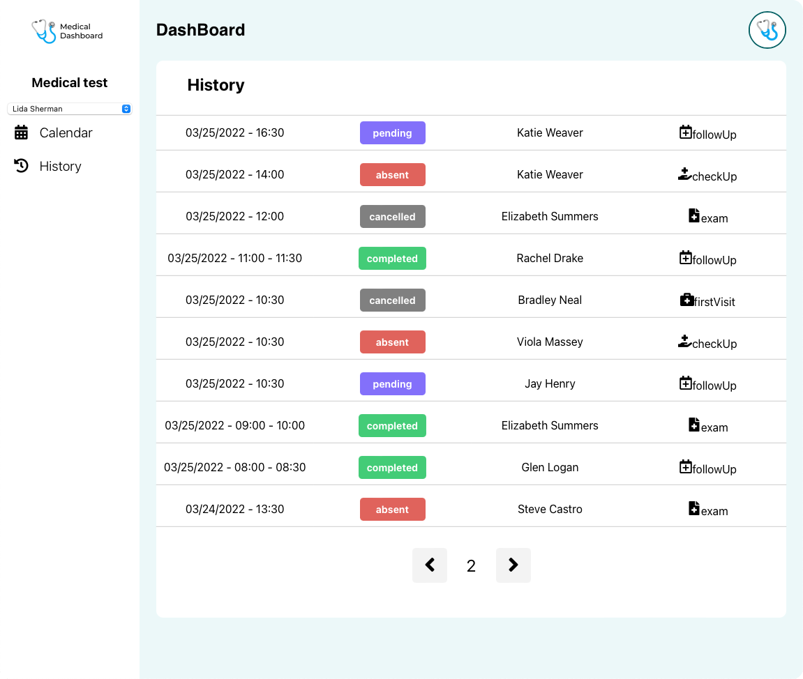
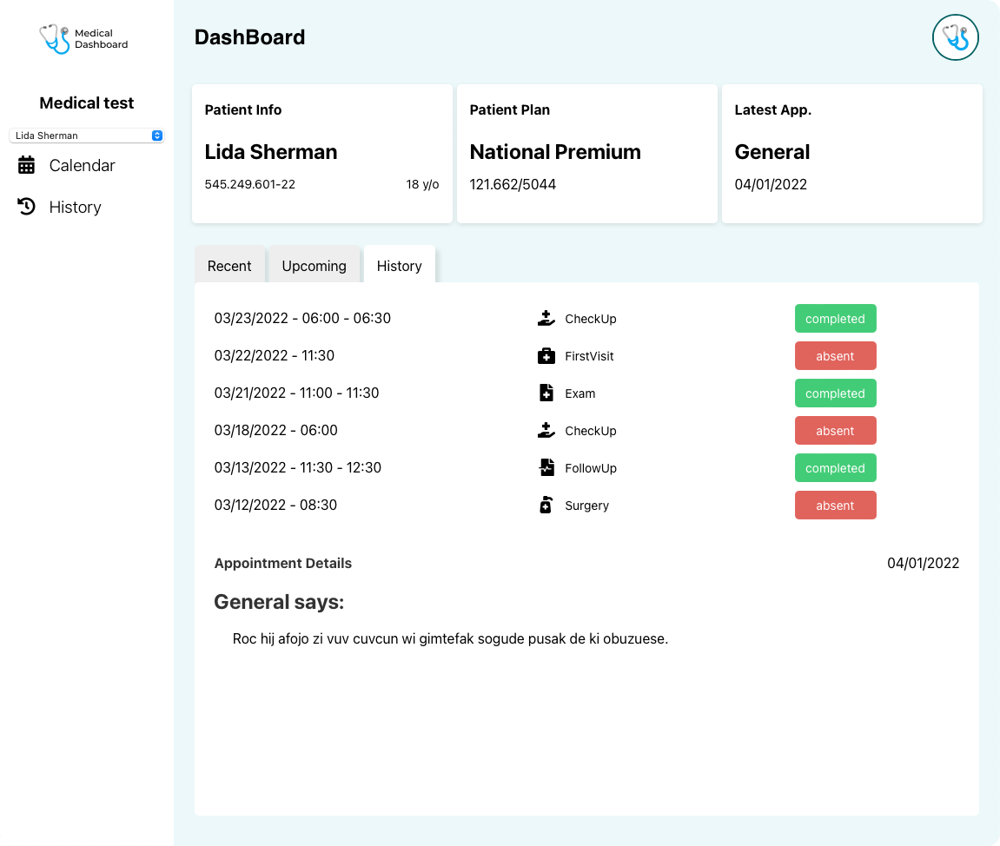

# Medical Dashboard
<p align="center">
  
  </br>
</p>

# Description
  <p align="center">
      
    &nbsp;&nbsp;&nbsp;&nbsp;&nbsp;&nbsp;&nbsp;&nbsp;&nbsp;&nbsp;&nbsp;&nbsp;&nbsp;
    
     &nbsp;&nbsp;&nbsp;&nbsp;&nbsp;&nbsp;&nbsp;&nbsp;&nbsp;&nbsp;&nbsp;&nbsp;&nbsp;
    
  </p>

Medical Dashboard to manage healthy center.

- List the appointments history of all patients;
- Select only one patient and to see their appointments;
- See a working calendar that updates dynamically; [Not Working]

### Up-coming features
- Possibility to register new patients;
- Create new medical specialties;
- Register new doctors;
- Live chat between patients and the doctor.

This application was made with the powerful combination of ReactJS and Typescript and the development stack includes the following tools:

- [React Router Dom](https://v5.reactrouter.com/web/guides/quick-start)
- [React Icons](https://react-icons.github.io/react-icons/)
- [Styled Components](https://styled-components.com)
- [Axios](https://axios-http.com/ptbr/docs/intro)
- [Jest](https://jestjs.io/pt-BR/)

# Getting Started
To get started, clone the project using the command
```
git clone
``` 
or just download the zip folder from repositories, run on terminal the following command line:

```
yarn install
``` 

After this, start your application using:

```
yarn start
```

# Structure

```yaml
medical-dash/
├── src/ # Source folder
│	│── assets/ # Assets folder with logo and icon
│	│── Components/ # Components that compose the application
│	│	│── __tests__/ # Dedicated to tests components
│	│	│── Calendar/ # Calendar component
│	│	│── Dashboard/ # Main application view
│	│  	│	│── Navbar/ # Header of application
│	│  	│	└── Sidebar/ # component for navigation through application
│	│  	│		│── PatientSelect/ # Select component that lists patients
│	│  	│		└── SidebarLink/ # List usable links 
│	│	│── History/ # History of patients appointment  
│	│  	│		└── Pagination/ # Components to divide appointments in lists of ten 
│	│	│── Loading/ # Loading component 
│	│	└── SelectedPatients/ # 
│	│  			└── PatientInformation/	# Page of patient informations 
│	│── Pages/ # Main application folder
│	└── utils/ # Destinated to all formatters used
└── jest.config.js # Jest config file
└── package.json # npm dependencies
```

# Code Overview

This entire application was made with ReactJS & Typescript, and combined with Styled Components to make functional components using only CSS.
</br> 
In certain moments of development I had to use basic Javascript functions to build the code logic, as the following one:

- Function to take a ten patients list generated previously to build an pagination structure.
```javascript
const pageLimit = Math.ceil(appointments.length / 10);
    if (index % 10 === 0) {
      for (let i = 0; i < pageLimit; i++) {
        tempArray.push(appointments.slice(i * 10, i * 10 + 10));
      }
    }
    const filterArray = tempArray.splice(0, tempArray.length);
    return filterArray;
```


### Main functions

- Get patients to be selected on a drop down list
```javascript
const PatientSelect = ({
  patients,
  onPatientChange,
}: IPatientProps): JSX.Element => {
  const [selectedPatient, setSelectedPatient] = useState<IPatient>(
    {} as IPatient,
  );
  const handlePatientChange = useCallback(
    (event: ChangeEvent<HTMLSelectElement>) => {
      const value = event.target.value;
      const findPatientById = patients.find(
        (patient) => patient.id === Number(value),
      );
      if (typeof findPatientById !== 'undefined') {
        setSelectedPatient(findPatientById);
      }
      onPatientChange(Number(value));
    },
    [patients, setSelectedPatient, onPatientChange],
  );
```

### API requests
Using Axios

- Getting Appointments
```typescript

```

```javascript
async function getAppointments(): Promise<void> {
    setIsLoading(true);
    const response = await axios.get(
      'api goes here',
    );
    setAppointments(response.data);
    setIsLoading(false);
    return response.data;
  }
```

- Getting Patients

```javascript
async function getPatients(): Promise<void> {
    const response = await axios.get(
      'api goes here',
    );
    setPatients(response.data);
    return response.data;
  }
```

# Screenshots





# Personal notes and a FAQ

This project allows me to elevate my CSS skills. The first challenge was create the calendar by using CSS only. Great challenge for me that in my last company, I was forced to become an dependencies installer, by only using ready components libraries.

And I've learned new concepts, like unit tests.

## Why aply routing in this type application?

Assuming that the current application will grow and news functionality will be added in the future, is extremely recommended create components (and here is where React shines) and directs that components in a single route. By making sure that components will be rendered once in a time.

Routers allow user to move between the components of the application while preserving user state, improving the app’s user experience by simplifying the navigation.

React Router is one of the most popular frameworks for React applications and allows us to build "[single-page web applications](https://www.split.io/blog/react-router-feature-flags/)" with navigation without the page refreshing as the user navigates

## Why ReactJS & TypeScript?

ReactJS allow us divide all the resources and features by components, and this is great for future code changes, and we always need to think about the next person that will put the hands on the code and think how this can be scalable. And this deliver us to the Typescript.

Typescript works gracefully with React, with this powerful combination, the application becomes more scalable and more easier to do some maintenance.

## What I should do next?

The next steps that I personally could take, is refactor the code, principally the API references by creating a unique folder and catch the requisitions by using custom hooks. I’m the follower of principle: Make it work first, then improve.

